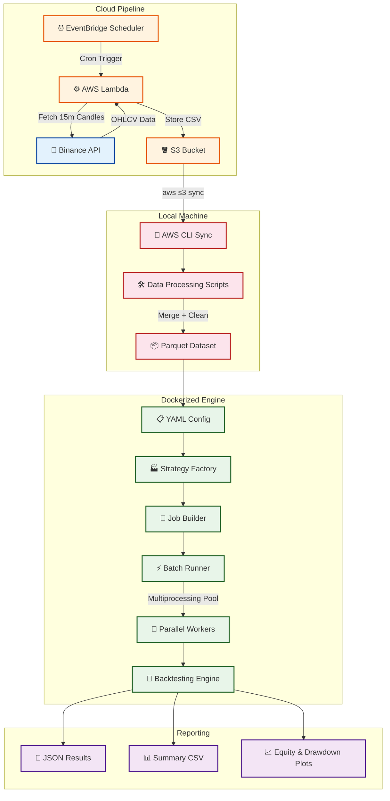
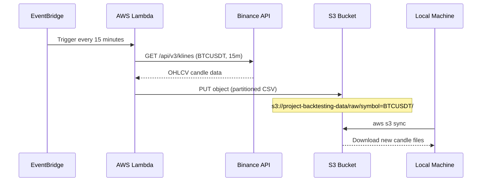
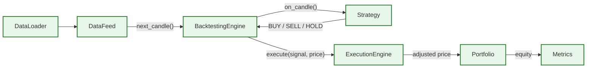
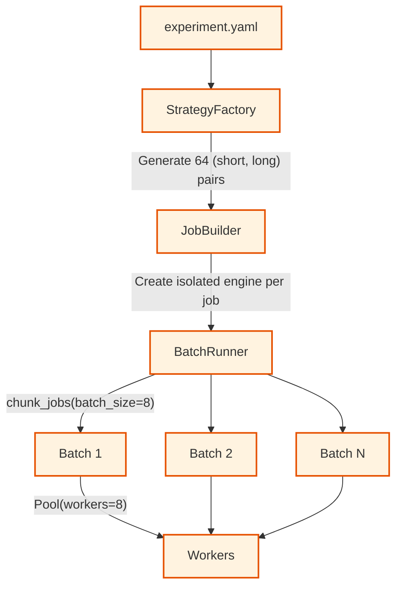

# ⚡ BackTesting Engine
### Quantitative Strategy Backtesting Framework with Cloud-Native Data Pipeline

---

## 📖 Project Overview

**BackTesting Engine** is a high-performance, config-driven quantitative backtesting framework designed to evaluate trading strategies at scale. It executes grid search across **64+ strategy parameter combinations** using batched multiprocessing, achieving throughput of **100K–300K candles/sec** with a shared-nothing architecture.

The system ingests live and historical **BTCUSDT 15-minute candle data** from the **Binance API** through a fully automated, event-driven AWS pipeline — using **Lambda**, **EventBridge**, and **S3** — and feeds it into a Dockerized backtesting engine for reproducible, deterministic experimentation.

The framework models real-world trading conditions including **slippage**, **commission fees**, **stop-loss risk management**, and **regime-aware trend filtering** using a 200 EMA, making it suitable for serious quantitative research and strategy validation.

---

## 🏗️ System Architecture

The system follows a **two-stage architecture**: an automated cloud data ingestion pipeline, and a local Dockerized backtesting engine that consumes the collected data.

### High-Level Architecture Flow



---

## ☁️ Cloud Data Ingestion Pipeline

The data pipeline is fully serverless, designed for **zero-maintenance continuous data collection**.

### Pipeline Flow



### Component Details

| Component            | Service          | Role                                                  |
| -------------------- | ---------------- | ----------------------------------------------------- |
| **Scheduler**        | EventBridge      | Cron-based trigger every 15 minutes                   |
| **Data Fetcher**     | AWS Lambda       | Pulls BTCUSDT 15m candles from Binance REST API       |
| **Storage**          | S3 Bucket        | Stores raw CSV files partitioned by symbol            |
| **Local Sync**       | AWS CLI          | `aws s3 sync` pulls new data to local `data/raw/`     |
| **Data Processing**  | Python Scripts   | Merges bootstrap + live data, deduplicates, cleans    |
| **Final Output**     | Parquet + CSV    | Compressed columnar format for fast engine ingestion   |

### Data Processing Pipeline

```
Bootstrap Data (Binance Historical API)     Live Data (Lambda-collected)
        ↓                                            ↓
  12-column raw CSVs                          Timestamped CSVs
        ↓                                            ↓
  Normalize to [open_time, O, H, L, C, V]    Normalize columns
        ↓                                            ↓
        └──────────── Merge & Deduplicate ──────────┘
                              ↓
                   Sort by open_time
                              ↓
              ┌───────────────┴───────────────┐
              ↓                               ↓
    final_dataset.parquet            final_dataset.csv
       (~65% smaller)              (human-readable backup)
```

**Total Dataset:** 35,000+ candles of BTCUSDT 15-minute data

---

## ⚙️ Engineering Breakdown

### 1. Backtesting Engine Core (`Engine/`)

The engine follows an **event-driven, candle-by-candle architecture** where each component is isolated and composable.



**Key Modules:**

| Module                | File                  | Responsibility                                      |
| --------------------- | --------------------- | --------------------------------------------------- |
| **DataLoader**        | `data_loader.py`      | Format-agnostic loader (CSV ↔ Parquet switching)     |
| **DataFeed**          | `datafeed.py`         | Sequential candle iterator (index-based traversal)   |
| **BacktestingEngine** | `backtesting_engine.py`| Core event loop — feed → signal → execute → update  |
| **ExecutionEngine**   | `execution.py`        | Simulates slippage (0.05%) and commission (0.1%)     |
| **Portfolio**         | `portfolio.py`        | Position management, stop-loss (2%), PnL tracking    |
| **Metrics**           | `metrics.py`          | Equity curve, trade log, win rate, max drawdown      |

---

### 2. Strategy Layer (`Strategies/`)

Strategies inherit from `BaseStrategy` and implement the `on_candle()` interface, returning `BUY`, `SELL`, or `HOLD` signals.

**MA Crossover Strategy (Regime-Aware)**

```python
# Simplified signal logic
if short_ma > long_ma and price > EMA_200 and momentum_spread > 0.1%:
    return "BUY"    # Trend-aligned entry with momentum filter
if long_ma > short_ma and position == LONG:
    return "SELL"   # Exit on reverse crossover
```

**Filters Applied:**
- **200 EMA Trend Filter** — Only enter longs when price is above the 200-period exponential moving average
- **Momentum Strength Filter** — Requires minimum 0.1% spread between short and long MA to avoid noisy crossovers
- **Long-Only Constraint** — No short selling; strategy exits positions on reverse crossover

---

### 3. Parallel Execution Framework (`Runner/`)

The runner layer orchestrates **large-scale strategy evaluation** using a shared-nothing multiprocessing architecture.



| Component           | File                  | Role                                                  |
| ------------------- | --------------------- | ----------------------------------------------------- |
| **ConfigLoader**    | `config_loader.py`    | Parses YAML experiment configuration                  |
| **StrategyFactory** | `strategy_factory.py` | Generates valid (short, long) parameter combinations  |
| **JobBuilder**      | `job_builder.py`      | Creates isolated engine instances per strategy variant |
| **BatchRunner**     | `batch_runner.py`     | Chunks jobs and dispatches to multiprocessing pool    |
| **Worker**          | `worker.py`           | Each worker loads data independently — zero shared state |

**Performance Characteristics:**

| Metric                    | Value                          |
| ------------------------- | ------------------------------ |
| Strategies per run        | 64 (8 short × 8 long windows) |
| Workers                   | 8 (configurable)               |
| Batch size                | 8                              |
| Candle throughput          | 100K–300K candles/sec          |
| Architecture              | Shared-nothing (no locks)      |
| Runtime reduction          | ~65% vs serial execution       |

---

### 4. Risk Management

The portfolio implements **per-trade risk controls** integrated directly into the candle processing loop.

```
Every Candle Tick:
  ├── Signal received? → Execute with slippage + commission
  │     └── BUY:  executed_price = price × (1 + 0.05%) + commission
  │     └── SELL: executed_price = price × (1 − 0.05%) − commission
  │
  ├── Position open? → Check stop loss
  │     └── price ≤ entry_price × 0.98 → Force exit (2% stop loss)
  │
  └── Update equity = cash + unrealized PnL
```

- **Full-Capital Position Sizing** — Allocates 100% of available cash per trade (`quantity = cash / price`)
- **2% Stop Loss** — Hard exit triggered per candle tick, independent of strategy signals
- **No Take Profit** — Lets winning trades run; exits only on strategy signal or stop loss
- **Slippage Modeling** — 0.05% adverse price impact on every execution
- **Commission Fees** — 0.1% per trade (modeled on exchange fee structures)

---

### 5. Reporting & Analytics (`reporting/`)

The reporting pipeline generates structured outputs after each backtest run.

**Outputs per Strategy:**

| Output                       | Format          | Location                          |
| ---------------------------- | --------------- | --------------------------------- |
| Full result dump              | JSON            | `results/runs/{strategy_id}.json` |
| Summary row                  | CSV (appended)  | `results/summary.csv`             |
| Equity curve plot            | PNG             | `results/plots/{id}_equity.png`   |
| Drawdown curve plot          | PNG             | `results/plots/{id}_drawdown.png` |

**Enriched Analytics (post-run):**

- `pnl_per_trade` — Average PnL per trade
- `pnl_to_dd_ratio` — Risk-adjusted return metric
- `rank_by_pnl` — Strategy ranking by total profit
- `rank_by_drawdown` — Strategy ranking by minimum drawdown

---

### 6. Data Optimization (`Scripts/`)

| Script                        | Function                                              |
| ----------------------------- | ----------------------------------------------------- |
| `build_final_dataset.py`      | Merges bootstrap + live data, deduplicates, cleans    |
| `bootstrap_merge.py`          | Handles Binance historical data format conversion     |
| `csv_to_parquet.py`           | Converts CSV → Parquet (Snappy compression)           |
| `csv_to_partitioned_parquet.py`| Creates year-partitioned Parquet for selective reads  |

**Storage Optimization Results:**

- **~65% reduction** in dataset size via Parquet columnar format
- **~60% faster** data loading through partitioned datasets
- **Format-agnostic** data loader enables seamless CSV ↔ Parquet switching

---

## 🐳 Docker Containerization

The engine is fully containerized for **reproducible, deterministic execution**.

```dockerfile
FROM python:3.11-slim
WORKDIR /app
COPY . /app
RUN pip install --no-cache-dir -r requirements.txt
CMD ["python", "main.py"]
```

**Volume Mounts:** Data and results are mounted from the host system, ensuring:
- Input data persists outside the container
- Output results are accessible after container termination
- Config can be hot-swapped without rebuilding the image

```bash
docker run --rm \
  -v %cd%\data:/app/data \
  -v %cd%\results:/app/results \
  -v %cd%\config:/app/config \
  backtesting_engine
```

---

## 🛠️ Tech Stack

### Core Engine

| Technology   | Purpose                                  |
| ------------ | ---------------------------------------- |
| Python 3.11  | Core language                            |
| Pandas       | Data manipulation and loading            |
| NumPy        | Numerical computation                    |
| PyArrow      | Parquet read/write with Snappy compression|
| Matplotlib   | Equity and drawdown curve visualization  |
| PyYAML       | Experiment configuration parsing         |

### Cloud & Infrastructure

| Technology      | Purpose                                  |
| --------------- | ---------------------------------------- |
| AWS Lambda      | Serverless candle data fetcher           |
| AWS EventBridge | Cron-based scheduler (every 15 min)      |
| AWS S3          | Raw market data storage                  |
| Binance API     | Live BTCUSDT OHLCV data source           |
| Docker          | Containerized reproducible runtime       |
| AWS CLI         | Data sync from S3 to local machine       |

---

## 📁 Project Structure

```
BackTesting_Engine/
├── Engine/                          # Core backtesting engine
│   ├── backtesting_engine.py        # Main event loop
│   ├── data_loader.py               # Format-agnostic data loader
│   ├── datafeed.py                  # Candle-by-candle iterator
│   ├── execution.py                 # Slippage + commission simulator
│   ├── portfolio.py                 # Position & risk management
│   └── metrics.py                   # PnL, win rate, drawdown
│
├── Strategies/                      # Trading strategy implementations
│   ├── basic_strategy.py            # Abstract base strategy
│   └── ma_crossover.py             # MA Crossover with EMA regime filter
│
├── Runner/                          # Parallel execution framework
│   ├── config_loader.py             # YAML config parser
│   ├── strategy_factory.py          # Parameter grid generator
│   ├── job_builder.py               # Isolated engine builder per job
│   ├── batch_runner.py              # Batched multiprocessing dispatcher
│   ├── parallel_runner.py           # Direct parallel runner
│   └── worker.py                    # Shared-nothing worker process
│
├── reporting/                       # Output & analytics pipeline
│   ├── result_writer.py             # JSON + CSV result persistence
│   ├── plots.py                     # Equity & drawdown curve generator
│   └── analytics.py                 # Post-run enrichment & ranking
│
├── Scripts/                         # Data processing utilities
│   ├── build_final_dataset.py       # Bootstrap + live data merger
│   ├── bootstrap_merge.py           # Historical data format handler
│   ├── csv_to_parquet.py            # CSV → Parquet converter
│   └── csv_to_partitioned_parquet.py# Year-partitioned Parquet builder
│
├── tools/
│   └── generate_report.py           # Clean + run + report pipeline
│
├── config/
│   └── experiment.yaml              # Strategy grid & engine configuration
│
├── data/
│   ├── raw/                         # Raw market data from S3
│   │   ├── bootstrap/               # Binance historical candles
│   │   └── symbol=BTCUSDT/          # Lambda-collected live candles
│   └── Processed/                   # Merged final datasets
│
├── results/                         # Backtesting outputs
│   ├── runs/                        # Per-strategy JSON results
│   ├── plots/                       # Equity & drawdown PNGs
│   └── summary.csv                  # Aggregated strategy comparison
│
├── Dockerfile                       # Container specification
├── benchmark.py                     # Performance benchmarking tool
├── main.py                          # Entry point
└── requirements.txt                 # Python dependencies
```

---

## 🚀 Getting Started

### 1. Clone the Repository

```bash
git clone https://github.com/Rudy-123/BackTesting_Engine.git
cd BackTesting_Engine
```

### 2. Install Dependencies

```bash
pip install -r requirements.txt
```

### 3. Sync Market Data from S3

```bash
aws s3 sync s3://project-backtesting-data/raw/ ./data/raw/
```

### 4. Build & Merge Dataset

```bash
python Scripts/build_final_dataset.py
```

### 5. Run Backtesting Engine

```bash
python main.py
```

### 6. Or Run with Docker

```bash
docker build -t backtesting_engine .
docker run --rm \
  -v %cd%\data:/app/data \
  -v %cd%\results:/app/results \
  backtesting_engine
```

### 7. Check Results

```
results/
  ├── runs/         → Per-strategy JSON files
  ├── plots/        → Equity & drawdown curves
  └── summary.csv   → Ranked strategy comparison
```

---

## 📌 Future Enhancements

- Multi-asset support (ETH, SOL, BNB)
- Walk-forward optimization
- Monte Carlo simulation for strategy robustness
- Live paper trading integration
- Sharpe ratio and Sortino ratio metrics
- Cloud-based distributed backtesting on AWS ECS

---

## 🤝 Contributing

Contributions are welcome.

1. Fork the repository
2. Create a feature branch
3. Commit your changes
4. Open a pull request

---

## 📄 License

This project is licensed under the **MIT License**.

---

## ⭐ Acknowledgements

BackTesting Engine was built to explore **quantitative strategy evaluation**, **cloud-native data pipelines**, **high-performance parallel computation**, and **reproducible research environments** using modern Python and AWS infrastructure.
