# ⚡ BackTesting Engine
### Quantitative Strategy Backtesting Framework with Cloud-Native Data Pipeline

---

## 📖 Project Overview

**BackTesting Engine** is a high-performance, config-driven quantitative backtesting framework designed to evaluate trading strategies at scale. It executes grid search across **64+ strategy parameter combinations** using batched multiprocessing, achieving throughput of **100K–300K candles/sec** with a shared-nothing architecture.

The system ingests live and historical **BTCUSDT 15-minute candle data** from the **Binance API** through a fully automated, event-driven AWS pipeline — using **Lambda**, **EventBridge**, and **S3** — and feeds it into a Dockerized backtesting engine for reproducible, deterministic experimentation.

The framework models real-world trading conditions including **slippage**, **commission fees**, **stop-loss risk management**, and **regime-aware trend filtering** using a 200 EMA, making it suitable for serious quantitative research and strategy validation.

---

## 🏗️ System Architecture

The system follows a **two-stage architecture**: an automated cloud data ingestion pipeline, and a local Dockerized backtesting engine that consumes the collected data.

### High-Level Architecture Flow

```mermaid
graph TD
    classDef cloud fill:#e3f2fd,stroke:#0d47a1,stroke-width:2px
    classDef aws fill:#fff3e0,stroke:#e65100,stroke-width:2px
    classDef engine fill:#e8f5e9,stroke:#1b5e20,stroke-width:2px
    classDef output fill:#f3e5f5,stroke:#4a148c,stroke-width:2px
    classDef data fill:#fce4ec,stroke:#b71c1c,stroke-width:2px

    subgraph Cloud Pipeline
        EB["⏰ EventBridge Scheduler"]:::aws
        Lambda["⚙️ AWS Lambda"]:::aws
        Binance["📡 Binance API"]:::cloud
        S3["🪣 S3 Bucket"]:::aws
    end

    subgraph Local Machine
        Sync["🔄 AWS CLI Sync"]:::data
        Scripts["🛠️ Data Processing Scripts"]:::data
        Parquet["📦 Parquet Dataset"]:::data
    end

    subgraph Dockerized Engine
        Config["📋 YAML Config"]:::engine
        Factory["🏭 Strategy Factory"]:::engine
        JobBuilder["🔧 Job Builder"]:::engine
        BatchRunner["⚡ Batch Runner"]:::engine
        Workers["👷 Parallel Workers"]:::engine
        BTE["🧠 Backtesting Engine"]:::engine
    end

    subgraph Reporting
        JSON["📄 JSON Results"]:::output
        CSV["📊 Summary CSV"]:::output
        Plots["📈 Equity & Drawdown Plots"]:::output
    end

    EB -->|"Cron Trigger"| Lambda
    Lambda -->|"Fetch 15m Candles"| Binance
    Binance -->|"OHLCV Data"| Lambda
    Lambda -->|"Store CSV"| S3
    S3 -->|"aws s3 sync"| Sync
    Sync --> Scripts
    Scripts -->|"Merge + Clean"| Parquet
    Parquet --> Config
    Config --> Factory
    Factory --> JobBuilder
    JobBuilder --> BatchRunner
    BatchRunner -->|"Multiprocessing Pool"| Workers
    Workers --> BTE
    BTE --> JSON
    BTE --> CSV
    BTE --> Plots
```



---

## ☁️ Cloud Data Ingestion Pipeline

The data pipeline is fully serverless, designed for **zero-maintenance continuous data collection**.

### Pipeline Flow


---

## ⚙️ Engineering Breakdown

### 1. Backtesting Engine Core (`Engine/`)

The engine follows an **event-driven, candle-by-candle architecture** where each component is isolated and composable.


**Key Modules:**

| Module | File | Responsibility |
|--------|------|---------------|
| DataLoader | `data_loader.py` | Format-agnostic loader (CSV ↔ Parquet) |
| DataFeed | `datafeed.py` | Sequential candle iterator |
| BacktestingEngine | `backtesting_engine.py` | Core event loop |
| ExecutionEngine | `execution.py` | Slippage + commission simulation |
| Portfolio | `portfolio.py` | Position management + stop-loss |
| Metrics | `metrics.py` | PnL, win rate, drawdown |

---

### 2. Strategy Layer (`Strategies/`)

Strategies inherit from `BaseStrategy` and implement `on_candle()` returning `BUY`, `SELL`, or `HOLD`.

```python
if short_ma > long_ma and price > EMA_200 and momentum_spread > 0.1/100:
    return "BUY"

if long_ma > short_ma and position == "LONG":
    return "SELL"
```

**Filters Applied:**
- 200 EMA Trend Filter
- Momentum Spread Filter (≥ 0.1%)
- Long-Only Strategy

---

### 3. Parallel Execution Framework (`Runner/`)

Shared-nothing multiprocessing design for large-scale strategy evaluation.

| Metric | Value |
|--------|--------|
| Strategies per run | 64 |
| Workers | 8 |
| Candle throughput | 100K–300K/sec |
| Architecture | No shared memory |
| Runtime Reduction | ~65% vs serial |

---

### 4. Risk Management

```
Signal → Execute with slippage + commission
Check Stop Loss → Exit at 2% loss
Update Equity → cash + unrealized PnL
```

- Full capital deployment
- 2% hard stop-loss
- 0.05% slippage
- 0.1% commission
- No take-profit (trend following)

---

### 5. Reporting & Analytics (`reporting/`)

| Output | Format | Location |
|--------|--------|----------|
| Full result | JSON | `results/runs/` |
| Summary | CSV | `results/summary.csv` |
| Equity Plot | PNG | `results/plots/` |
| Drawdown Plot | PNG | `results/plots/` |

---

### 6. Data Optimization (`Scripts/`)

- CSV → Snappy Parquet
- ~65% storage reduction
- ~60% faster loading
- Year-partitioned datasets
- Format-agnostic loader

---

## 🐳 Docker Containerization

```dockerfile
FROM python:3.11-slim
WORKDIR /app
COPY . /app
RUN pip install --no-cache-dir -r requirements.txt
CMD ["python", "main.py"]
```

Run:

```bash
docker build -t backtesting_engine .
docker run --rm \
  -v %cd%\data:/app/data \
  -v %cd%\results:/app/results \
  backtesting_engine
```

---

## 🛠️ Tech Stack

### Core
- Python 3.11
- Pandas
- NumPy
- PyArrow
- Matplotlib
- PyYAML

### Cloud
- AWS Lambda
- AWS EventBridge
- AWS S3
- Binance REST API
- Docker
- AWS CLI

---

## 🚀 Getting Started

```bash
git clone https://github.com/Rudy-123/BackTesting_Engine.git
cd BackTesting_Engine
pip install -r requirements.txt
aws s3 sync s3://project-backtesting-data/raw/ ./data/raw/
python Scripts/build_final_dataset.py
python main.py
```

---

## 📄 License

MIT License

---

## ⭐ Acknowledgements

Built to explore:
- Quantitative strategy evaluation  
- Cloud-native data pipelines  
- High-performance multiprocessing  
- Reproducible research environments  
