# ⚡ BackTesting Engine
### Quantitative Strategy Backtesting Framework with Cloud-Native Data Pipeline

---

## 📖 Project Overview

**BackTesting Engine** is a high-performance, config-driven quantitative backtesting framework designed to evaluate trading strategies at scale. It executes grid search across **64+ strategy parameter combinations** using batched multiprocessing with a shared-nothing architecture.

The system transitioned from a naive crossover approach to a **Regime-Aware Strategy**, transforming a -$39,000 baseline loss into a potential **+$17,800 profit** through advanced risk management, volatility filtering, and momentum validation.

The system ingests live and historical **BTCUSDT 15-minute candle data** from the **Binance API** through a fully automated, event-driven AWS pipeline — using **Lambda**, **EventBridge**, and **S3** — and feeds it into a Dockerized backtesting engine for reproducible, deterministic experimentation.

---

## 🏗️ System Architecture

The system follows a **two-stage architecture**: an automated cloud data ingestion pipeline, and a local Dockerized backtesting engine that consumes the collected data.

### High-Level Architecture Flow

```mermaid
graph TD
    classDef cloud fill:#e3f2fd,stroke:#0d47a1,stroke-width:2px
    classDef aws fill:#fff3e0,stroke:#e65100,stroke-width:2px
    classDef engine fill:#e8f5e9,stroke:#1b5e20,stroke-width:2px
    classDef output fill:#f3e5f5,stroke:#4a148c,stroke-width:2px
    classDef data fill:#fce4ec,stroke:#b71c1c,stroke-width:2px

    subgraph Cloud Pipeline
        EB["⏰ EventBridge Scheduler"]:::aws
        Lambda["⚙️ AWS Lambda"]:::aws
        Binance["📡 Binance API"]:::cloud
        S3["🪣 S3 Bucket"]:::aws
    end

    subgraph Local Machine
        Sync["🔄 AWS CLI Sync"]:::data
        Scripts["🛠️ Data Processing Scripts"]:::data
        Parquet["📦 Parquet Dataset"]:::data
    end

    subgraph Dockerized Engine
        Config["📋 YAML Config"]:::engine
        Factory["🏭 Strategy Factory"]:::engine
        JobBuilder["🔧 Job Builder"]:::engine
        BatchRunner["⚡ Batch Runner"]:::engine
        Workers["👷 Parallel Workers"]:::engine
        BTE["🧠 Backtesting Engine"]:::engine
    end

    subgraph Reporting
        JSON["📄 JSON Results"]:::output
        CSV["📊 Summary CSV"]:::output
        Plots["📈 Equity & Drawdown Plots"]:::output
    end

    EB -->|"Cron Trigger"| Lambda
    Lambda -->|"Fetch 15m Candles"| Binance
    Binance -->|"OHLCV Data"| Lambda
    Lambda -->|"Store CSV"| S3
    S3 -->|"aws s3 sync"| Sync
    Sync --> Scripts
    Scripts -->|"Merge + Clean"| Parquet
    Parquet --> Config
    Config --> Factory
    Factory --> JobBuilder
    JobBuilder --> BatchRunner
    BatchRunner -->|"Multiprocessing Pool"| Workers
    Workers --> BTE
    BTE --> JSON
    BTE --> CSV
    BTE --> Plots
```



---

## 📊 Results & Performance

The engine's primary objective was to optimize a standard Moving Average crossover into a robust, tradeable strategy.

### The PnL Turnaround

Original baseline strategies often yielded significant losses due to "choppy" markets. By implementing Regime Filtering and Dynamic Stop Losses, we achieved a major performance shift:

| Metric | Naive Strategy (Baseline) | Optimized Regime-Aware |
|--------|---------------------------|-------------------------|
| Total PnL | -$39,120 | +$17,855 |
| Win Rate | 21.0% | 28.3% |
| Max Drawdown | -$41,881 | -$11,406 |
| Stop Loss | Fixed 1.0% | Dynamic 2.5x ATR |

### Top Performing Strategy (Summary)

Data extracted from latest 64-run grid search (`results/summary.csv`)

| Strategy ID | Short/Long | Total PnL | Max Drawdown | PnL/DD Ratio |
|-------------|------------|-----------|--------------|--------------|
| ma_25_110 | 25 / 110 | $17,855.17 | -$11,406 | 1.56 |
| ma_25_120 | 25 / 120 | $13,130.36 | -$9,846 | 1.33 |
| ma_20_110 | 20 / 110 | $12,012.50 | -$14,460 | 0.83 |

---

## ☁️ Cloud Data Ingestion Pipeline

The data pipeline is fully serverless, designed for zero-maintenance continuous data collection.

### Pipeline Flow


---

## ⚙️ Engineering Breakdown

### 1. Backtesting Engine Core (Engine/)

The engine follows an event-driven, candle-by-candle architecture where each component is isolated and composable.


#### Key Modules

| Module | File | Responsibility |
|--------|------|---------------|
| DataLoader | data_loader.py | Format-agnostic loader (CSV ↔ Parquet) |
| DataFeed | datafeed.py | Sequential candle iterator |
| BacktestingEngine | backtesting_engine.py | Core event loop |
| ExecutionEngine | execution.py | Slippage + commission simulation |
| Portfolio | portfolio.py | Position management + stop-loss |
| Metrics | metrics.py | PnL, win rate, drawdown |

---

### 2. Strategy Layer (Strategies/)

The strategy validates every signal against the current market "regime" to filter out noise.

#### The "Regime Sniper" Logic:

```python
if cross_up and price > EMA_200 and high_volatility and bullish_momentum:
    return "BUY"
```

#### Filters Applied:

- EMA 200 Slope: Ensures entries only in long-term uptrends  
- ATR Volatility Filter: Ensures market activity is sufficient  
- RSI Momentum (50-75): Ensures strong buyer interest without being overbought  
- Dynamic ATR Stop Loss: Entry Price - (2.5 * ATR)

---

### 3. Parallel Execution Framework (Runner/)

Shared-nothing multiprocessing design for large-scale strategy evaluation.

| Metric | Value |
|--------|--------|
| Strategies per run | 64 |
| Workers | 8 (Configurable) |
| Architecture | No shared state / No locks |
| Runtime Reduction | ~65% vs serial execution |

---

### 4. Risk Management

Signal → Execute with slippage + commission  
Check ATR Stop Loss → Exit if volatility-adjusted bound hit  
Update Equity → cash + unrealized PnL  

- 100% Capital Allocation per trade  
- Dynamic 2.5x ATR Stop-Loss  
- 0.05% Slippage Impact  
- 0.1% Commission Fees  
- No take-profit (Pure trend-following)

---

### 5. Reporting & Analytics (reporting/)

| Output | Format | Location |
|--------|--------|----------|
| Full result | JSON | results/runs/ |
| Summary | CSV | results/summary.csv |
| Equity Plot | PNG | results/plots/ |
| Drawdown Plot | PNG | results/plots/ |

---

### 6. Data Optimization (Scripts/)

- CSV → Snappy Parquet: ~65% storage reduction  
- Speed: ~60% faster data loading  
- Selective Reads: Year-partitioned datasets  
- Format-Agnostic: Supports CSV and Parquet  

---

## 🐳 Docker Containerization

The engine is fully containerized for reproducible, deterministic research.

```dockerfile
FROM python:3.11-slim
WORKDIR /app
COPY . /app
RUN pip install --no-cache-dir -r requirements.txt
CMD ["python", "main.py"]
```

### Volume Mounts

```bash
docker run --rm \
  -v %cd%\data:/app/data \
  -v %cd%\results:/app/results \
  backtesting_engine
```

---

## 🛠️ Tech Stack

### Core Engine

- Python 3.11  
- Pandas / NumPy  
- PyArrow  
- Matplotlib  
- PyYAML  

### Infrastructure

- AWS Lambda  
- AWS S3  
- Docker  
- Binance API  

---

## 🚀 Getting Started

```bash
git clone https://github.com/Rudy-123/BackTesting_Engine.git
cd BackTesting_Engine
pip install -r requirements.txt
aws s3 sync s3://project-backtesting-data/raw/ ./data/raw/
python Scripts/build_final_dataset.py
python main.py
```

---

## 📄 License

This project is licensed under the MIT License.

---

## ⭐ Acknowledgements

Built to explore quantitative strategy evaluation, cloud-native data pipelines, and high-performance computation using Python and AWS infrastructure.
